# 基于协同过滤的推荐系统算法研究
# Research on Collaborative Filtering Algorithms

[摘要] 随着“大数据”的出现，人们在庞大的数据面前更是显得束手无策。信息过载的问题成为了让人们头疼的事情。社会信息超过了个人或系统所能接受、处理或有效利用的范围，并导致故障。
当前要解决这个问题主要有两个途径：一类是使用搜索引擎，比如谷歌、百度、搜狐等，但是这类方法需要用户的需求明确，用户也得十分清楚的表达出自己的意向，其搜索结果的质量很大程度上依赖于用户对需求描述的准确度；另一类就是基于推荐系统，这种推荐系统不需要用户十分明白清楚自己的需求，它通过用户的历史行为数据来预测推断出用户的需求以及兴趣，通过建立模型和数据挖掘，为用户准确推荐。因此，推荐系统更符合当今时代的节奏和需求。
本文主要研究了利用用户行为数据，基于邻域的算法。分别在User-based和Item-based下实验相似度的修正和改进，不同相似度对协同过滤计算方法评测数值的影响。讨论因子Ｋ值（与用户兴趣最相近用户数）对算法的Precision、Recall、Coverage、Popular的影响。UserCF和ItemCF的综合比较。实验结果表明，Ｋ值和算法的各项评测指标也不完全成正相关或负相关，选择合适的Ｋ值获得最高精准度是非常重要的。
<!-- more -->

[关键词] 推荐系统；协同过滤；用户相似度；UserCF；ItemCFAbstract: With the emergence of "big data", people is become in front of the huge data. Information overload problem has become to let people have a headache. Social information than individual or system can accept, processing or the scope of the effective use of and leads to failure.
Now to solve this problem there are two main ways: one kind is to use search engines, such as Google, baidu, sohu, etc., but this method needs the user's needs clear, users have to very clearly expressed his intention, the quality of its search results to a large extent depends on the user accuracy of requirement description; Another kind is based on the recommendation system, this kind of recommendation systems do not need to users are fully aware of the needs of the clear, it through the history of user behavior data to predict the deduce the user's needs and interests, through the establishment of model and data mining, accurate recommendations for the user. Recommendation system, therefore, more in line with the rhythm of The Times and requirements.
This paper mainly studied the use of user behavior data, the algorithm based on neighborhood. Respectively under the User - -based and Item - -based experiment similarity correction and improvement, different similarity on collaborative filtering evaluation the effect of numerical calculation method. Discuss the factor K value (close to users in the most number of users) on the Precision of the algorithm, Recall, Coverage, the influence of the Popular. UserCF and ItemCF comprehensive comparison. The experimental results show that the K value and algorithm of each evaluation index is not entirely into positive correlation or negative correlation, select the appropriate K value to obtain the highest accuracy is very important.
Key words: Recommended System;Collaborative Filtering;User Similarity;UserCF;ItemCF
<!-- more -->

## 目 录

1. [绪 论](##绪论)
  1. [本课题的研究意义及必要性](##本课题的研究意义及必要性)
  2. [相关领域国内外应用的现状及发展趋势](##相关领域国内外应用的现状及发展趋势)
  3. [推荐系统及协同过滤简介](##推荐系统及协同过滤简介)
    1. [推荐系统](#推荐系统)
    2. [协同过滤](协同过滤)
2. [实验设计和算法测评](#实验设计和算法测评)
  1. [引言](#引言)
  2. [数据集](#数据集)
  3. [实验设计](#实验设计)
  4. [算法测评](#算法测评)
3. [基于用户的协同过滤算法](#基于用户的协同过滤算法)
  1. [引言](#引言)
  2. [基础算法](#基础算法)
  3. [相似度算法的改进](#相似度算法的改进)
4. [基于物品的协同过滤算法](#基于物品的协同过滤算法)
  1. [引言](#引言)
  2. [基础算法](#基础算法)
  3. [用户活跃度和物品相似度关系](#用户活跃度和物品相似度关系)
5. [UserCF和ItemCF的比较](#UserCF和ItemCF的比较)
  1. [引言](#引言)
  2. [UserCF和ItemCF的综合比较](#UserCF和ItemCF的综合比较)
[参考文献](#参考文献)

## 1 绪 论

### 1.1 本课题的研究意义及必要性

上个世纪末以来，互联网得到了飞跃式的发展，网络上的信息量呈指数增长，更随着互联网技术的进一步发展，海量的信息如潮水般涌现在人们眼前，在购物网站上琳琅满目的物品、Netflix上数以万计的电影资源。人们在巨大的信息海洋面前变得束手无策，这就出现了“信息过载”的重要问题。
为了解决“信息过载”，人们提出了“个性化服务”的概念，“个性化服务”使得信息更加具体有用的呈现在用户面前，为不同用户提供不同的服务或信息内容。个性化推荐系统(personalized rcoommcndcrsystems)是当今私人订制化服务研究领域重要的一点，所谓的个性化推荐系统是在海量数据挖掘基础上的一种预测性的平台，它可以帮助网站为目标用户提供完全个性化的推荐，自动完成目标用户可能的个性化选择。被推荐的物品可以是任意物品，衣服，鞋子，家具，书籍、电影甚至可以是楼房、景区等等。这个系统有赖于目标用户的过去的行为数据，通过一定的算法，预测出目标用户感兴趣的物品。
当今，对于信息超载问题的最常用的解决方案之一就是信息检索系统，这些检索系统的代表比如Google、Baidu等，它们在为用户分流处理信息方面有着重要的作用。但搜索引擎的关键字相对于的搜索结果是单一的，死板的。这样单一死板的信息处理方式，不能满足现今信息的多样化，传播方式的多样化，所以搜索引擎仍然无法很好地解决信息超载问题。[1]
推荐系统可以做出个性化的推荐，把用户最可能喜欢的，需要的东西推荐出来，将有用的信息提炼出来，帮助用户阅读信息，做出判断。推荐系统被很好的应用在商业领域，其具体表现在：(1)电商推荐方面，它可以帮助销售商找到用户的潜在需求，提高利润，指引销售策略。(2)个人娱乐方面，可以为目标用户推荐最有可能喜好的影视作品，提高网站服务的用户粘性。(3)提供内容服务的网站方面，个性化新闻内容服务帮助用户方便快捷的浏览新闻资讯。(4)大众服务，提供极为个性化的旅行方案，问题咨询等等。[2]推荐系统现有的算法和技术已有十几年了，但是它的研究还是很火热，因为Web已经成为了我们日常生活的必备，大量的数据我们已经仅凭人力难以消化，我们需要算法和技术的更新。[3]

### 1.2 相关领域国内外应用的现状及发展趋势

推荐系统的研究，国外比国内很早就开始了。上世纪末时Resnick&Varian正式定义了电子商务推荐系统。[4]自从1999年，计算机协会ACM(Association for Computing Machinery)在每年都召开一次电子商务主题的研讨会，会议中，有很多就是关于推荐系统的论文；数据挖掘特别兴趣组SIGKDD(Special Interest Group on KDD)和信息检索兴趣小组SIGIR(Special Interest Group on Information Retrieval)是该协会下两个研究小组，它们也分别在1999年和第24届的研究会议上，将推荐系统单独列为一个研讨的方向。在商业巨头与学术会议的激励下，推荐系统的研究也如日中天，机器学习和数据挖掘技术的飞速发展为协同过滤算法的实现提供了新的思想，协同过滤算法以数据矩阵为训练集，在机器学习和建模以后，作出智能的推荐预测。[4]  
相对而言，国内对推荐系统的研究晚一些。受到国外先进水平的影响，国内的研究也慢慢发展起来。现在国内在推荐系统的理论和应用方面也到得了一定成果。国内和国外对推荐系统的研究水平还是差距很大的。为了提高推荐系统在国内的研究水平，推荐系统高峰论坛于2011年3月在北京地大国际会议中心举行，很多相关方面的学者参加了此次峰会。到会的各位专家都展示了自己平台的推荐系统，并积极探讨了推荐系统的技术难点问题以及将来的发展方向。这次峰会很好推动了国内的推荐系统研究和发展。另外，为了进一步激发高校对于推荐系统的研究热情，中国科技大学与人民大学统计学院筹备了“第一届全国大学生数据挖掘邀请赛”并在2011年3月举行。此次比赛的主题是社交网站的会员推荐算法的研究，面向国内所有高校和研究所的在校学生。比赛的平台是为某大型的婚恋网站研发更高效的智能推荐系统，增加匹配的成功率。此次比赛增加了高校学生对推荐系统的了解和学习，大大带动了整个推荐系统研究的发展。这种激励性的活动，让推荐系统在国内的研究也发展的火热。

## 1.3 推荐系统及协同过滤简介

### 1.3.1 推荐系统

如果你想买一双足球鞋，你可以走进一家鞋店，看到货架上的所有球鞋，转一圈找到自己喜欢的球鞋，然后买单。你也可以打开淘宝，在搜索框里输入足球鞋三个字，然后你会看到很多足球鞋，找到喜欢的球鞋，然后付款，等待送货上门。这都是用户明确知道自己需求的情况，知道自己要找怎么的足球鞋。
但是，要是用户没有十分明确的需求时呢？例如图1.1，你想看一本书，但你面对偌大的书架，面对浩瀚的书海，你不知所措。这时候需要一个人或者一个工具来帮助你，给你一些选择方面的建议。但是，不总是刚好有人帮助你做选择，你需要一个了解你的自动化工具帮助你，它知晓你的兴趣，历史行为，帮你从琳琅满目的各类图书中选出符合你兴趣的书来——它就是推荐系统。

<small class="img-hint">图1.1 推荐系统</small>
要想明白推荐系统是怎样工作的，我们可以参考在现实生活中我们遇到不知如何选择时是如何求助的。
我们会向我们的朋友去咨询，我们该如何选择。这种社会化的推荐，我们期望好友会给我们恰当的建议。
我们会去在搜索引擎上寻找我们喜欢的书籍，或者喜爱的作者，然后看看我们没看过的，感兴趣的。例如，我非常喜欢鲁迅，于是就去谷歌搜索鲁迅的作品，看到自己还没有看过的作品，就会去买一本读读。这种方法是寻找到和自己以前阅读过的书籍相似的书籍。推荐系统可以根据我们的历史数据，推测出我们可能喜爱的书籍。
我们还可能去参考热门书籍的排行榜，看看大家都在读什么书，什么书的评论比较好，然后比较选择出自己感兴趣的书。如果可以找到和自己的历史兴趣相一致的用户，参考他们喜欢的书籍，也许可以得出比热门排行榜更准确的推荐。这种方法就被称为基于协同过滤的推荐。
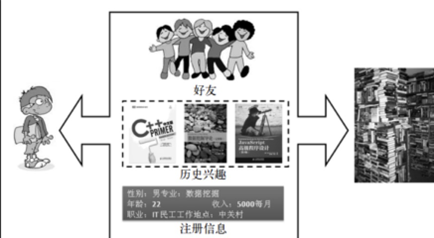
<small class="img-hint">图1.2 三种推荐方法</small>
我们可以看出，推荐算法的最根本的问题在于把物品和用户通过某种计算方法联结在一起，而联结的方法是多种多样的。个性化的推荐系统已经得到了广泛的实战，最著名的例子就是被称为“推荐系统之王”的亚马逊。在国内像淘宝，豆瓣等都有很好的推荐系统。
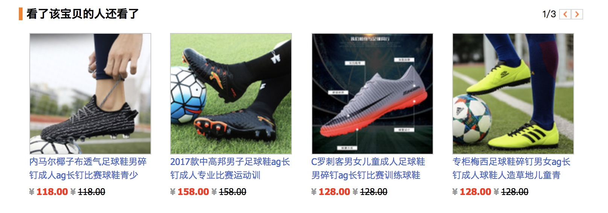
<small class="img-hint">图1.3 淘宝足球鞋推荐</small>

### 1.3.2协同过滤

“协同过滤”一词是九十年代中期提出的，在后来得到了更深入的研究和广泛的应用。协同过滤讲的是：两个用户甲和乙具有相似的历史行为（比如购物，阅读，观影），那么他们在某些项目上具有相似的兴趣。通常，协同过滤技术都会有一个用户历史数据库，需要整合和处理历史数据，然后来预测用户的兴趣，给用户给出合理的推荐。
基于协同过滤的推荐（Collaborative Filtering recommendation）已经成为一项很受欢迎的技术。早期基于内容过滤是分析物品的内容属性，再进行推荐，但是这样的算法需要全面的了解推荐物品的各项信息，过于繁重和复杂。而协同过滤是分析出用户兴趣，在目标用户的用户群中匹配到相似（兴趣）用户，综合评估相似用户对某一信息的评价，然后预测出目标用户对物品的喜好。
协同于其他物品或者用户，给用户做出推荐，这正是信息时代的巨大优势，我们利用好用户的数据，就可以得到更准确的预测和推荐。

## 2 实验设计和算法测评

### 2.1 引言

推荐系统的实验法有很多种，最为主要的有3种：离线实验、用户调查和在线实验。此次设计主要采用的是离线实验的方法，它不需要用户直接的参与到实验中，只要有数据就可以进行，可以高速的计算，测试很多不同的算法。下面将从数据集、实验设计、算法测评三个方面来介绍。

### 2.2 数据集

实验采用的是GroupLens所提供的MovieLens数据集，MovieLens是推荐系统都会用的测评数据集。在这个数据集中，用户对自己以前所看过的电影进行打分，分值设为1--5。此次实验所用的是2016年1月更新的最新数据包，由700个用户基于10000部电影的100000评级和6100个标签的应用程序，大小为1M。

### 2.3 实验设计

此次协同过滤算法的研究就采用离线实验的方法。
通过用户日志系统可以获得用户的行为数据，直接采用GroupLens所提供的MovieLens数据集。
把数据集按照一定的方法划分为训练集和测试集。
在训练集上对数据集合模拟训练，然后得到用户的兴趣模型，最后通过测试集进行预测。
按照离线实验，分析推荐算法的系统性能评测指标，在测试集上计算出算法的结果和性能。
推荐系统的离线实验基本都是基于离线的数据集，它不依赖实时的系统来为它提供算法实验的平台和数据，只需要从历史的数据库中提取的用户行为数据集就行。离线实验的最大的好处是：不需要真实用户的参与，它可以更方便快捷的计算出结果，可以更加快速，方便的运算大量的不相同的算法。
第一，我们可以把用户的数据平均的随机给划分为M个小的数据集，然后随机的挑选出一个成为实验的数据集，那么没有成为实验数据集的就成为了训练集。接下来，我们就要在训练集上计算出用户的兴趣模型，在测试集上对目标用户的行为进行预测，最后得出推荐算法评测指标。为了结果的科学性，我们需要进行多次实验，并且使用大量不同的测试集，把多次实验计算出的评测指标取其平均值，将平均值作为最后的评测结果。
代码每次选用了不同的K值，seed是随机数，M次实验就可以得到M个不同的训练集和数据集，分别进行各自的实验，取最后的均值，很好的防止了实验结果的过拟合。

### 2.4 算法测评

基于协同过滤的推荐算法我们使用Precision、Recall、Coverage、Popular等来定性的描述算法的性能。
准确率
对于推荐系统算法来说，这可能是最重要的指标，它标识这个推荐系统算法预测用户行为准确性的能力，从推荐系统出现开始，可以说100% 的推荐系统都要首先考虑这个问题。
简单来说就是训练集上计算的预测行为和测试集上用户的实际行为的重合度。重合度越高，那么推荐算法的准确度也就越高。
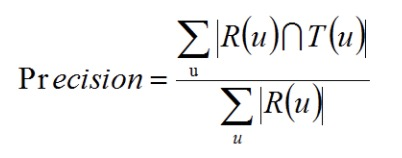
召回率
召回率和准确率似乎很相似，但是两者是有区别的。Recall也叫查全率，查全率是“推荐到相关的物品”比“推荐到相关的物品与未推荐但相关的物品之和”，当然越大越好。而准确率是“推荐相关的物品”比“推荐相关的物品与推荐的不相关的物品之和”。从这里看两者似乎没什么联系，但是在实际应用中，两者存在着相互制约的关系。
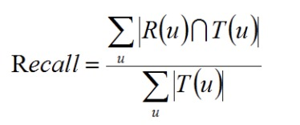
覆盖率
就字面意思来讲，Coverage就是被推荐出来的物品占物品总数的比例。这一指标是商家会关注的，他们得关注自己的产品是否被推荐给了用户。比较热门推荐物品的Coverage是比较低的，因为热门的物品很容易被推荐，而热门物品在整个产品中所占的比值总是不
是很大。推荐系统的Matthew effect也是现在所要解决的主流问题。

流行度
推荐物品的流行度测量的是推荐结果的新颖度，要是被推荐出来的物品都是热门的物品，那么就意味着推荐算法的新颖度相对较低，相反，则算法的新颖度比相对较高。但这个评测是比较粗略的，因为具体用户是否知道这个东西是不确定的，需要进一步的对用户做具体调查。

## 3 基于用户的协同过滤算法

### 3.1 引言

基于用户的协同过滤算法是推荐系统诞生以来历史最悠久的算法，此算法被提出于1992年，最早期用于邮件的过滤使用，在1994后被应用于新闻的过滤。基于用户的协同过滤算法在推荐系统的历史舞台中扮演有重要的角色，下面就从基础算法开始分析。

### 3.2 基础算法

在每当我们要学习一门课程的时候，我们总会问老师或者师哥一些问题，例如“我学习这门课程该看哪些参考书啊”，“有什么关于这门课程学习的网站没”等等，这时候，被问者总会给我们一些推荐，这就是一个个性化推荐的典型案例。我们在碰到这类问题时，所寻找的人总是和我们有相似的研究目标或者兴趣。因此，在推荐系统当中，当用户甲需要个性化推荐的时候，我们往往可以寻找和他有着相似爱好或者行为的别的用户，然后把那些用户喜欢的、但是不在甲的历史记录范围的物品推荐给甲，这样的方法就是基于用户的协同过滤算法。
其实，基于用户的协同过滤算法就是两个步骤：
寻找出和推荐需求用户的兴趣相似的用户群。
匹配出这个用户群中用户喜欢的，但是推荐需求用户没有听过的物品并推荐给用户。
这里最为重要的就是计算两个用户的兴趣相似度，用户行为的相似度是协同过滤主要的参考指标。这里我们假设出u和v两个用户，用N(u)指代u所有过良性反馈的物品集合，用N(v)指代v所有过良性反馈的物品集合。那么，我们就可以使用余弦相似度的计算公式计算u和v的兴趣相似度：
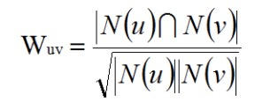
以下图的用户历史行为记录，来简单计算用户之间的兴趣相似度。可以看出A对物品{a, b, d}有过历史行为，B对物品{a, c}有过历史行为，利用余弦相似度公式计算A和B的兴趣相似度为
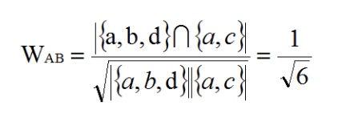
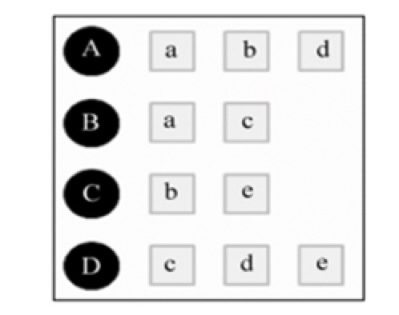
<small class="img-hint">图3.1 用户兴趣表</small>
同理，我们可以计算出A和C、D的相似度：
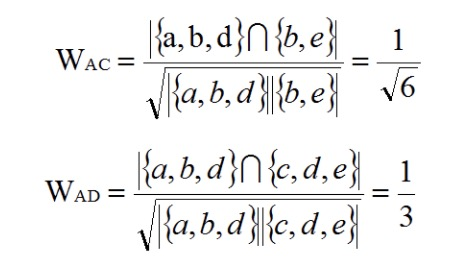
这种计算方法的时间复杂度是平方级的，很耗费资源。由于很多用户之间并没有对共同的相似行为，余弦相似度的分子是零。因此，我们可以先对矩阵进行优化，排除掉分子为零的情况，这样就可以优化计算时间。
我们可以建立物品到用户的倒排表，对于每个物品来说我们都只保存对该物品产生过行为的用户即稀疏矩阵C[u][v]两个用户历史行为的交集。如果u和v都是倒排表K个物品所对应的用户列表，就有C[u][v]=K。我们去遍历每个物品它所对应的用户列表，把两两用户对应的C[u][v]加1，就能够排除掉为零的情况。
首先，我们得建立物品—用户的倒排表。接下来，建立一个4×4的用户相似度矩阵W，对于物品a，我们把W[A][B]和W[B][A]加1，对于物品b，我们把W[A][C]和W[C][A]加1，按照这样的计算方法。把所有的物品扫描完后，我们就得到了最后的W。这个W是余弦相似度中的分子，将W除以分母我们就可以得到最终的用户兴趣相似度。
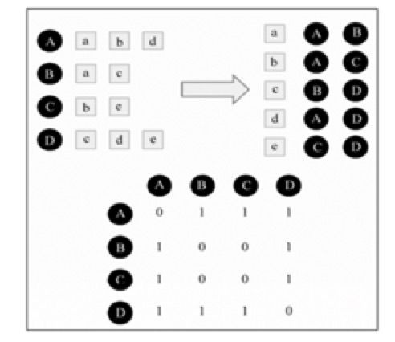
<small class="img-hint">图3.2 物品用户倒排表</small>
	计算出了用户之间的相似度值后，User-based算法就会推荐出和用户兴趣最相似的K个用户他们所喜欢物品。

这里的S(u, K)是包含和用户u的兴趣最接近的K个用户，N(i)是对物品i有过行为的用户集合，Wuv是用户u和用户v的兴趣相似度，Rvi代表用户v对物品i的兴趣。选取K=3，用户A对物品c、e没有过行为，因此可以把这两个物品推荐给用户A。根据UserCF算法，用户A对物品c、e的兴趣是：

	UserCF算法有一个重要的参数值K，K为选取的和目标用户兴趣最相似的用户个数，然后推荐这K个用户感兴趣的物品，在不同的K值下，算法的性能也有很大的区别。我们可以发现，K值的调整对算法的每一项指标都会产生一定的影响。

<small class="img-hint">图3.3 UserCF算法在不同K值参数下的性能</small>
	【Precision和Recall】		推荐系统的Precision和Recall并不是和K值成简单的线性关系。在我所选用的数据集中，当K值在40左右的时候Precision和Recall达到了峰值。适合的K值对推荐系统有着重要的影响。
	【Popular】		可以看出推荐结果的的流行度随着K值的增长都在增大，K值是参考的兴趣相似用户人数，人数越多，结果中的热门物品也就自然越多。
	【Coverage】		可以看出随着K值的增大，算法的覆盖率在降低，覆盖率的降低是因为UserCF的推荐在K值增大时越来越趋于热门物品，那么相对的长尾物品自然推荐率降低，覆盖率也就降低了。

### 3.3 相似度算法的改进

前面我们在计算用户的相似度的时候简单的使用了余弦相似度，但是这样计算的准确度不够高。例如，两个用户都购买了《中华字帖》，这不是很能说明他们的兴趣相似，在中国，我们很多人都会购买《中华字帖》。但是，两个用户都购买了《推荐系统实践》这本书，那么他们两个兴趣相似度就比都买《中华字帖》的要高。有人提出了对相似度进行惩罚：
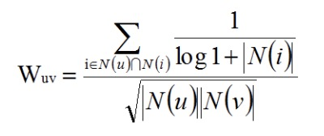
公式中的对数运算惩罚了用户的相似兴趣集合热门物品对相似度的影响。
在这里将算法改进前后的推荐系统的性能作比较，选取K值为80，我们可以看到，改进后的个性性能的数据都有所提升。

<small class="img-hint">图3.4 UserCF算法和User-IIF算法的对比</small>

## 4 基于物品的协同过滤算法

### 4.1 引言

基于物品的协同过滤算法是当前应用最为广泛的算法，无论是推荐系统鼻祖的亚马逊，还是国内推荐体验很好的豆瓣，都是基于这种的推荐算法。下面先从基础算法开始介绍，然后分析算法的改进，以及基于数据集测评推荐性能。

###4.2 基础算法

基于用户的协同过滤算法被应用于实践中，但是存在有一些比较突出的缺点。在数据越来越庞大的今天，用户的历史行为数据越来越多，用户兴趣相似度矩阵将变得无比庞大，难以计算，其运算的时间复杂度和空间复杂度骤增。还有就是基于用户的协同过滤算法有一个盲点，它不能够对推荐结果做出解释。在这样的情况下，亚马逊公司首先提出了这个算法——基于物品的协同过滤算法。
基于物品的协同过滤算法会把用户之前喜欢的相似物品推荐给目标用户，就例如，你购买过《唐诗三百首》它就会把和《唐诗三百首》相似的《宋词一百篇》推荐给你。ItemCF并不是基于计算物品内容属性的相似度，而是计算分析用户行为从而计算出物品的相似度。比如，贝克汉姆和罗纳尔多具有很大的相似度，是因为喜欢贝克汉姆的人大多也喜欢罗纳尔多。在淘宝、京东等页面的底部的“猜你喜欢”就是这样推荐出来的。

<small class="img-hint">图4.1 京东书籍推荐</small>
基于物品的协同过滤算法也可以被分为两步：
计算出物品之间的相似度。
依据物品的相似度以及目标用户的历史行为数据得出目标用户的推荐集合。
物品的相似度可以简单的定义为：
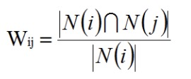
这里的分母是对物品i喜欢的用户，分子是同时对物品i和j喜欢的用户。这个公式可以理解为简单比例问题。但这种定义方法存有缺陷，比如说喜欢贝克汉姆的人很多，贝克汉姆就是热门，使用该公式就使得任何物品和贝克汉姆都具有很大的相似度，这不利于挖掘长尾物品信息。可以使用下面的公式惩罚热门物品的权重：
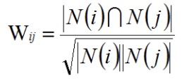
在基于物品的协同过滤推荐算法中，两个物品相似度的产生是因为他们被多个用户共同喜欢，目标用户的历史行为和兴趣都是计算物品相似度的参考。
类似于User-based算法，Item-based算法也同样也能够建立一个倒排表，每个用户建立一个他所喜欢的物品集合，接下来，将他的物品集合列表中的物品两两相加。
下图是一个简单计算物品之间相似度的例子。从左到右是模拟实现计算的过程。例如，第一行就表示用户喜欢a,b,d，将物品两两加1，最后将这些矩阵相加得到最终的结果矩阵，一个数组就表示同时喜欢行标物品和列标物品的用户。
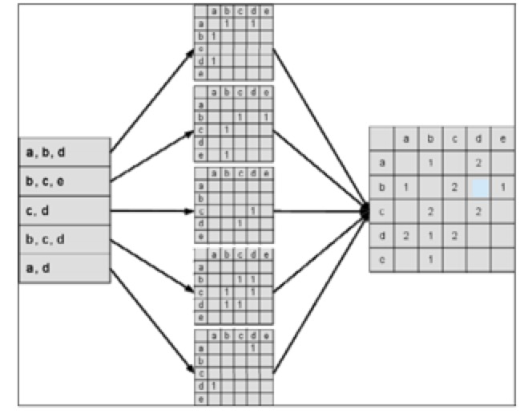
<small class="img-hint">图4.2 物品相似度计算的例子</small>
ItemCF算法在计算过程中不会有任何内容属性的比较，但是结果可以看出相似的物品在存在有一定内容的相似性。下面的公式可以计算出某一用户对某一物品的兴趣：
此公式表示，在用户历史行为表现出感兴趣的物品与其越相似的物品，被优先推荐。	下面举一个简单的例子，《C++Primer中文版》和《编程之美》是一个用户喜欢的两本书，推荐算法会找出和它们相似的3本书，然后计算出每本书的用户感兴趣的程度。
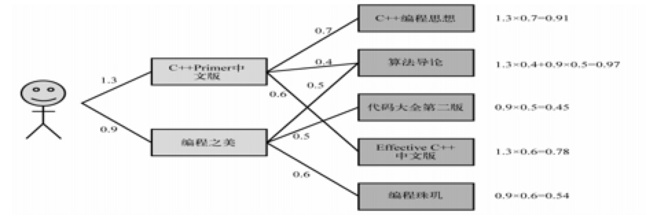
<small class="img-hint">图4.3 一个简单的基于物品推荐的例子</small>
我们可以看出，对用户推荐是可以根据用户的历史行为为依据，也就是说可以解释推荐。下图是离线实验的各项指标，K值在10左右得到的评测结果最优。

【Precision和Recall】		ItemCF的推荐的Precision和Recall同UserCF一样，都不和K值成完全的线性关系，K值的选择就成为了相当重要的指标。
【Popular】		Popular在K值增加的情况下逐渐升高，但到一定的临界值时就不会有太大浮动的改变。
【Coverage】		K值和推荐系统的Coverage成反比。

<small class="img-hint">图4.4 ItemCF算法离线实验的结果</small>

### 4.3 用户活跃度和物品相似度关系

在协同过滤中，每个用户的历史兴趣集合都对物品的相似度产生影响，但是每个用户所产生的影响是不同的。假如一个鞋店老板他进货购买了1万只鞋子，但是这一万只鞋子并不都是他感兴趣的，而这些鞋子覆盖了很多的种类，这个老板的对于其他物品的相似度
远不如一个只购买足球鞋的青年。这就存在了相似度失真的问题。
上面的算法抑制了活跃用户对相似度的影响，用活跃度对数的倒数来修正物品相似度。使得计算更加精准。
在现实的计算中，这种惩罚的力度不够，为了躲避相似度矩阵太巨大这种不良情况，通常我们会直接忽略不计他的历史数据，不让参与到相似度的计算中。
为了便于比较，直接选取修正前的最佳K值10，由图可知，算法修正前后的精度很接近，但修正后的推荐结果的覆盖率得到了很大的提升，流行度有所下降，可以说修正后的推荐性能得到了提高。

<small class="img-hint">图4.5 ItemCF算法和ItemCF-IUF算法的对比</small>
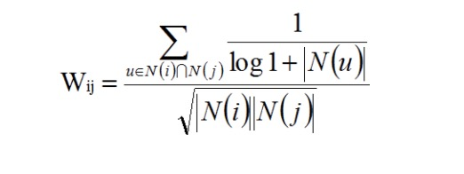

## 5 UserCF和ItemCF的比较

### 5.1引言

User-based和Item-based都是协同过滤的经典推荐系统算法，协同过滤的优点就是能够整合数据，参考历史的、已知的推测出未知的。UserCF在推荐系统中是比较早的推荐算法，早在上世纪90年代就被应用于电子邮件中，后来又被GroupLens应用于新闻的推荐。ItemCF相对来说是近期的算法了，亚马逊对ItemCF应用也得到了企业级的肯定。但两者的优劣如何呢？下面我们就讨论下。#

### 5.2 UserCF和ItemCF的综合比较

从这两个算法的来看，User-based推荐的是和他有着相似兴趣的人喜欢的物品，Item-based推荐是和他之前喜欢的物品相似的物品。前者主要参考了同兴趣者的爱好，后者主要借鉴了用户自己的历史兴趣。前者是社会化，群体化的推荐，反映了类似群体的喜好特征，而后者是更加个性化的推荐，反映了用户自己的兴趣历史。
例如在新闻中，很多人都喜欢看的是热门的新闻，范围比较广的。新闻的热门度，时效性都是推荐系统重点要考虑的，而比较深度的个性化在这里不是很强调。User-based就可以推荐出社会性，小群体性的新闻，大家就了解到小圈子内关注的热点，也保证了相对的个性化推荐。相对于算法的运算性能来说，User-based需要维护的是用户相似性表，不像Item-based要维护一张物品的相关度表，在新闻中，物品的更新度比用户快的多。
而在ItemCF中，多用于图书，电子商务，电影网站等。在这些领域中，用户的兴趣有很强的针对性，比较稳固。要对一个资深的技术人员推荐书籍，就更要依赖于他的历史兴趣，更好的发掘长尾物品，因为技术人员的书籍不会是太热门的大众书籍，需要更好的个性化推荐，ItemCF则能满足这样的需求。这些网站需求的个性化推荐是帮助人们发现和他熟悉、感兴趣的领域相关的物品，网站内容的物品不会更新太快，更有利于挖掘用户的兴趣点。
【性能】
UserCF适合用户数量不是很多的场合，在这样的情况下，用户的相似度矩阵的更新代价不会太大。
ItemCF适合于物品数少的场合，要是物品太多，相应的物品相似度矩阵太庞大，计算复杂度高。
【领域】
UserCF时效性好，在不是很强调个性化的领域。
ItemCF长尾物品的推荐，需要很强的个性化推荐的领域。
【实时性】
UserCF用户的新行为不会立竿见影的左右推荐结果。
ItemCF用户的行为对推荐结果的影响很迅速。
【推荐理由】
UserCF没有明确的和让人信服的推荐解释。
ItemCF可以提供合理的推荐解释，让用户信服。

## 参考文献

[1] 马卓．协同过滤推荐算法的研究与改进[D]．燕山大学．2015
[2] 张娜．电子商务环境下的个性化信息推荐服务及应用研究[D]．合肥工业大学， 2007
[3] Dietmar Jannach，Markus Zanker，Alexander Felfernig．Recommender Systems[M]．蒋凡译．人民邮电出版社．2013
[4] Resnick, Varian.Recommender systems[J].Communication of the ACM, 1997,40(3):56-58
[5] 项亮．推荐系统实践[M]．人民邮电出版社．2012
[6] Magnus Lie Hetland．Python基础教程[M]．司维等译．人民邮电出版社．2014
[7] 刘青文．基于协同过滤的推荐算法研究．中国科学技术大学[J]．2013
[8] 曾春，邢春晓，周立柱．个性化服务技术综述[J]．软件学报．2002．13(10)：1952—196l
[9] 邓爱林，朱扬勇，施伯乐．基于项目评分预测的协同过滤推荐算法[J]．软件学报，2003，14(9)：1621-1628
[10] 曾伟.推荐算法与推荐网络研究[D]. 电子科技大学 2015
[11] 秦利静.推荐系统模型与学习算法研究[D]. 清华大学 2014
[12] 邓爱林.电子商务推荐系统关键技术研究[D]. 复旦大学 2003
[13] 杨海涛.一个基于搜索结果的个性化推荐系统[D]. 郑州大学 2006
[14] 张雪文.智能推荐系统中协同过滤算法的研究[D]. 上海交通大学 2008
[15] 韩慧俊.电子商务个性化推荐系统的研究[D]. 上海交通大学 2007
